<!-- ===================================================== -->
<!--            SABBIR AHAMED · GITHUB PROFILE             -->
<!--   AI Automation Solutions Expert · Voice AI · Systems -->
<!-- ===================================================== -->

<picture>
  <source media="(prefers-color-scheme: dark)" srcset="./dark.svg">
  <source media="(prefers-color-scheme: light)" srcset="./light.svg">
  
</picture>

<br/>

<div align="center">

**Building AI automation systems for modern businesses.**

AI Voice Agents · Business Automation · AI Systems

[Portfolio](https://mdsabbirahamed.com) &nbsp;·&nbsp; [LinkedIn](https://linkedin.com/in/sabbirahamedai) &nbsp;·&nbsp; [YouTube](https://youtube.com/@sabbirahamedai) &nbsp;·&nbsp; [X](https://x.com/sabbirahamedai) &nbsp;·&nbsp; [Instagram](https://instagram.com/sabbirahamedai)

</div>

---

## Introduction

I'm **Sabbir Ahamed** — an AI Automation Solutions Expert building AI-powered systems that automate repetitive business operations.

My focus is **Voice AI and automation systems** that help businesses handle conversations, capture leads, manage appointments, and connect their operational workflows. I don't just build AI tools. I build AI systems that run business operations.

```txt
WHO      Sabbir Ahamed
WHAT     AI Automation Solutions Expert
BUILDS   AI Voice Agents + Business Automation
FOR      Modern Businesses · Dental Clinics
HOW      AI + Voice + CRM + Automation
```

---

## What I Build

I design and deploy automation systems that replace manual, repetitive work — connecting voice, AI, and operational tools into workflows that run on their own.

- **AI Voice Agents** — phone agents that answer, qualify, and book, around the clock
- **Business Automation** — workflows that move data and tasks across your stack without manual effort
- **AI Systems** — practical AI wired into real operations, not demos

---

## AI Voice Agents

Voice AI is my primary capability. I build AI receptionists that handle live conversations and route the outcome straight into your systems.

```txt
CALL  →  AI RECEPTIONIST  →  QUALIFY  →  BOOK  →  CRM
```

- Answer inbound calls and handle FAQs
- Qualify callers and capture intent
- Book, reschedule, and cancel appointments
- Push every interaction into CRM and follow-up workflows

---

## Automation Systems

Beyond voice, I connect the operational layer that businesses run on — so leads, appointments, and follow-ups move automatically.

```txt
LEAD  →  AI  →  QUALIFY  →  CRM  →  FOLLOW-UP  →  BOOK
```

---

## Core Expertise

| | |
|---|---|
| AI Automation | Voice AI |
| AI Receptionists | CRM Automation |
| Appointment Automation | Lead Generation |
| AI Outreach | Business Process Automation |
| AI-Powered SEO | No-Code Automation |

---

## Technology Stack

**Automation**

`n8n` &nbsp; `Make.com` &nbsp; `Zapier`

**Voice AI**

`Vapi` &nbsp; `ElevenLabs` &nbsp; `Twilio`

**CRM / Operations**

`GoHighLevel` &nbsp; `Airtable` &nbsp; `Google Sheets` &nbsp; `Cal.com`

**AI / Infrastructure**

`OpenAI` &nbsp; `Supabase` &nbsp; `Postgres`

---

## Systems I Build

**AI Voice Receptionist**
AI-powered phone agent for answering calls, handling FAQs, and booking appointments.

**AI Appointment System**
Automated appointment booking, rescheduling, cancellation, and calendar management.

**AI Lead Capture System**
Captures leads and automatically routes them into CRM workflows.

**CRM Automation**
Automated lead follow-up, qualification, notifications, and pipeline movement.

---

## Dental Automation

**Primary niche: Dental Clinics.** AI receptionists for modern dental practices.

The problem is the same across clinics:

```txt
MISSED CALLS  ·  NO AFTER-HOURS COVERAGE  ·  MANUAL SCHEDULING
SLOW FOLLOW-UP  ·  ADMIN OVERLOAD
```

The system:

```txt
24/7 AI VOICE RECEPTIONIST
```

> Missed calls → lost patients. An AI receptionist answers, qualifies, and books — so opportunities get captured instead of going to voicemail.

---

## How I Work

I start from the business outcome, map the workflow, then build the system that runs it. Voice, AI, and CRM are wired into one flow — designed to be practical, reliable, and hands-off once deployed.

```txt
~/automation $ build --deploy
```

---

## Connect

<div align="center">

[**Portfolio**](https://mdsabbirahamed.com) &nbsp;·&nbsp; [**LinkedIn**](https://linkedin.com/in/sabbirahamedai) &nbsp;·&nbsp; [**YouTube**](https://youtube.com/@sabbirahamedai) &nbsp;·&nbsp; [**X**](https://x.com/sabbirahamedai) &nbsp;·&nbsp; [**Instagram**](https://instagram.com/sabbirahamedai)

<sub>● AI SYSTEM READY</sub>

</div>
